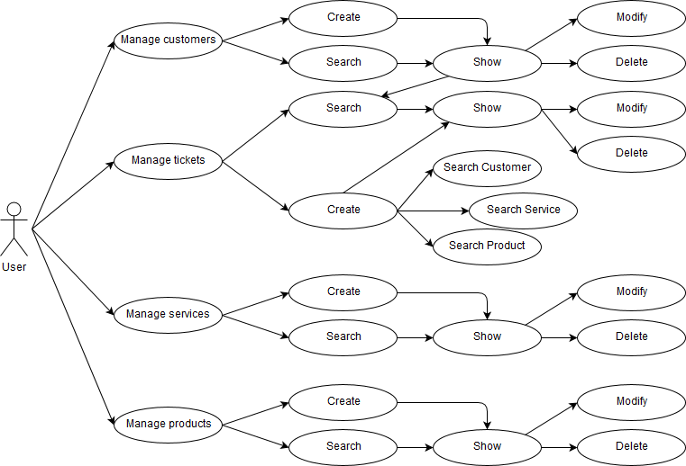
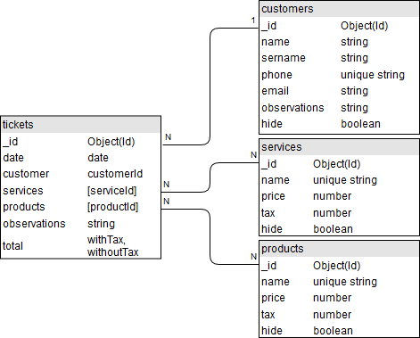
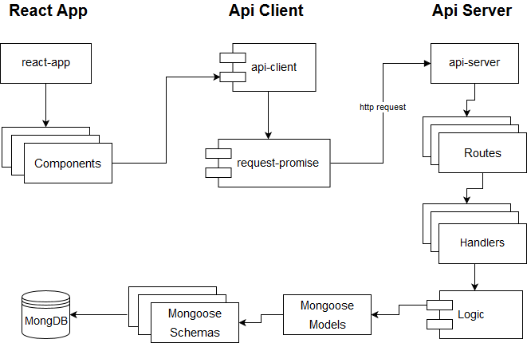

# Customer Management

## What is this?  
A three week final project for Skylab bootcamp.

A personalized customer managemnet for a hair salon. Gets the record of what services and/or products the customer recived.

It runs on MongoDB and Node.js

## Functional description

An user can Manage customers, tickets, services and products. Can create, search, modify and delete them.

## Data Model

## Block model

## Demo

You can try the app here: 
[Demo](http://eahob-cm.surge.sh)

                                                   
